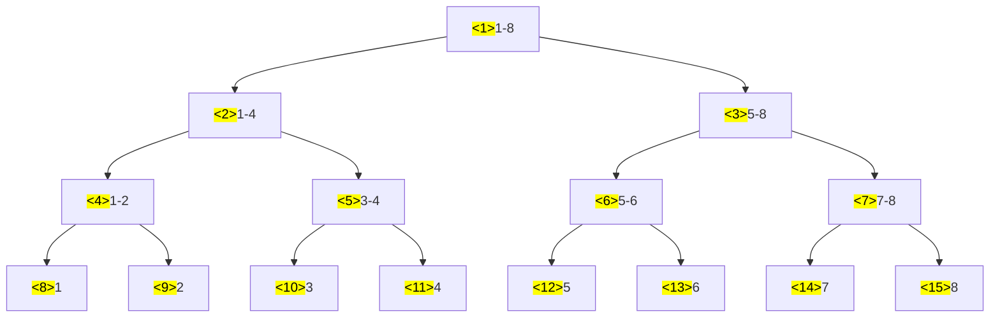

**问题**
1. 区间做同样的修改，例如区间加上、减去同样的数；
2. 区间查询，例如区间的和、区间的最大值；

如果使用普通的方法，则每次操作（区间修改和区间查询）都需要$O(n)$的时间复杂度，因此适合使用线段树来解决此类问题。

建议结合视频来学习：[B站灵茶山艾府](https://www.bilibili.com/video/BV15D4y1G7ms/?spm_id_from=333.788&vd_source=306d1e30d33142d7fd3bf0ece9237304)

# 树状数组
**树状数组**
树状数组是一种特殊的线段树，比较简单，所以我们先从树状数组开始学习。树状数组其结构如下：


从树状数组的结构图中我们可以看出来树状数组**适合单点修改，区间查询**的情况。

可以看出来每个`n`号节点管辖的区域为从`[n - lowbit(n) + 1, n]`区间，`lowbit(n)`是指`n`的最低位上的`1`及后面的`0`组成的数字，其实现为`x & (-x)`。

**建树**
对每个节点进行更新，同时如果存在父亲节点，也更新父亲节点，父亲节点的求法是`x + lowbit(x)`，时间复杂度为$O(n)$。
```cpp
void build(const vector<int>& nums)
{
    this->n = nums.size();
    this->_tree = vector<Node>(n + 1, 0);
    // 根据需求对节点进行操作，比如这里是求和
    // 那么已知一个节点n，则更新自己的父亲节点，父亲节点为n+lowbit(n)
    for (int i = 1; i <= n; i++) {
        _tree[i].val += nums[i - 1]; // 对节点的操作
        // 父亲节点
        int f = i + lowbit(i);
        if (f <= n) {
            _tree[f].val += _tree[i].val; // 对父亲节点的操作
        }
    }
}
```

**单点修改**
对单点修改需要其每个祖宗节点进行修改，时间复杂度为$O(log(n))$。
```cpp
// 对o节点进行某个操作，操作值为v
void update(int o, int v)
{
    while (o <= n) {
        _tree[o].val += v; // 对节点的操作
        o += lowbit(o);
    }
}
```

**区间查询**
对于区间`[L, R]`上的查询，可以根据`[1, R] - [1, L - 1]`来求出，时间复杂度为$O(log(n))$。
```cpp
// 求[1, x]的值
int subOp(int x)
{
    int sum = 0;
    while (x > 0) {
        // x节点的管辖区域为[x-lowbit(x)+1,x]
        sum += _tree[x].val; // 对节点的操作
        x = x - lowbit(x);
    }
    return sum;
}

// 求[L, R]的值
int Op(int L, int R)
{
    // [1, R] - [1, L - 1]
    return subOp(R) - subOp(L - 1);
}
```

# 线段树
**线段树**
线段树，其结构如下：

可以看出来适合**区间修改和区间查询**。

**建树**
